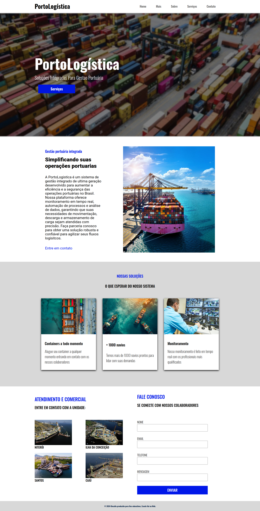

# Desafio 2 - Construção de Interface para o Projeto "Porto Logística"  
**Professor(a):** Samuel Silvério  
**Data de início:** 29/11/2024  
**Data de entrega:** 12/12/2024, até 23:59  

---

## Objetivo  
O desafio consiste em desenvolver uma interface responsiva para o projeto "Porto Logística", utilizando técnicas modernas de design e desenvolvimento web. Você deverá implementar uma página web que simule o layout de um site relacionado à logística portuária, com uma implementação fiel ao design fornecido no Figma.  

---

## Requisitos Técnicos  

1. **Unidades de Medida Relativas:**  
   - Utilize **largura da viewport (vw)**, **altura da viewport (vh)** e **rem** para que o layout se ajuste dinamicamente ao tamanho da tela.  

2. **Layout Flexível:**  
   - Estruture o layout da página utilizando **Flexbox**, garantindo o alinhamento e distribuição eficiente dos elementos em diferentes resoluções de tela.  

3. **Formulários:**  
   - Inclua tags de formulário como `<form>`, `<input>`, e `<textarea>` para simular interações de usuários.  

4. **Imagem de Fundo:**  
   - Use a propriedade `background-image` no CSS para inserir imagens de fundo no layout.  

5. **Tags Semânticas:**  
   - Utilize tags semânticas como `<header>`, `<section>`, `<article>`, e `<footer>` para organizar o conteúdo de maneira clara e compreensível, tanto para usuários quanto para buscadores.  

---

## Materiais de Apoio  

- **Protótipo no Figma:**  
  O design da interface está disponível no Figma e pode ser utilizado como guia para a implementação:  
  [Figma - Porto Logística](https://www.figma.com/design/HiQqNZdfEVGoBaxq1xZ4IK/PortoLogistica?node-id=0-1&node-type=canvas&t=smBCynahXdGvphX6-0)  

- **Conversores de Unidades:**  
  - [Conversor de Pixel para Rem](https://nekocalc.com/px-to-rem-converter?authuser=0)  
  - [Conversor de Pixel para VH / VW](https://khaledkzy.github.io/pixel-vh-vw-converter/?authuser=0)  

---

## Forma de Entrega  

- O código deve ser enviado para um repositório público no GitHub.  
- Certifique-se de que o repositório contém todos os arquivos necessários, incluindo HTML, CSS, e qualquer imagem utilizada no projeto.  

---

## Resoluções

- Mobile: 280px a 500px
- Tablet: 501px a 900px
- Laptop: 901px a 1500px
- Desktop: acima de 1501px

## Layout de Referência  

<figure>  
      
</figure> 

